### Iwt-medquery
    Sistema de agendamento e atendimento de consultas e exames.
    Criado em meados de 2011 com SpringMVC e Postgres,
    Modifiquei com a base H2Sql.

### Tecnologias
    Java 1.8
    SpringMVC
    Thymeleaf
    H2Sql

### Screenshots
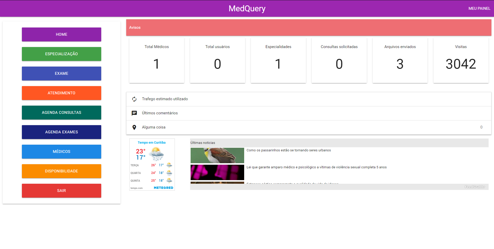
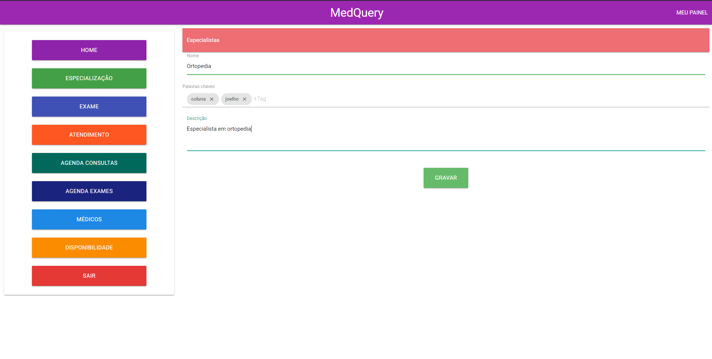
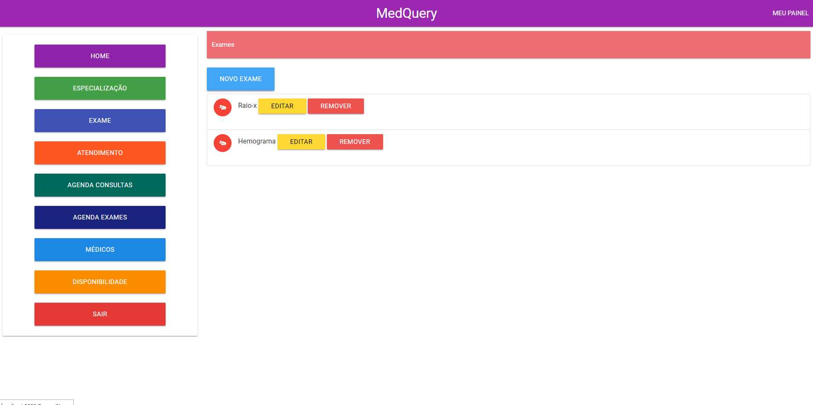
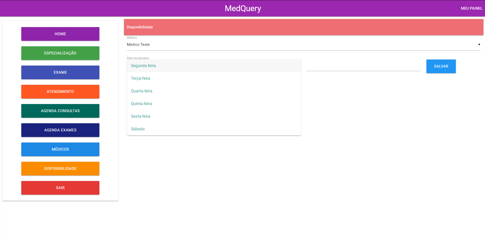
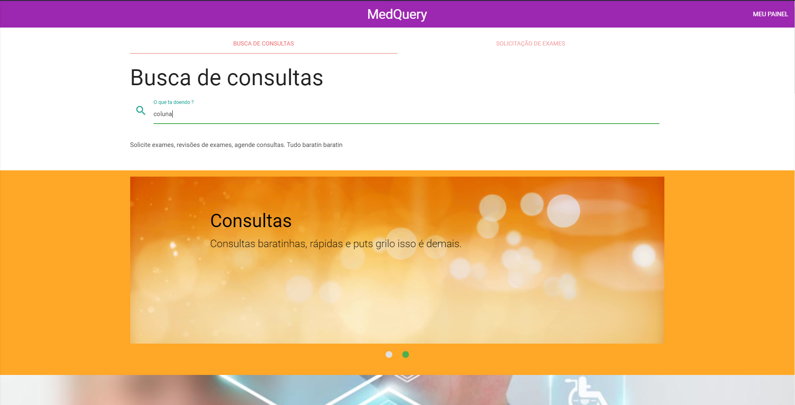

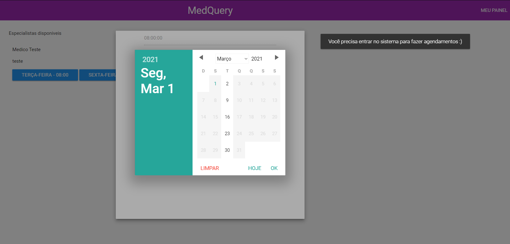
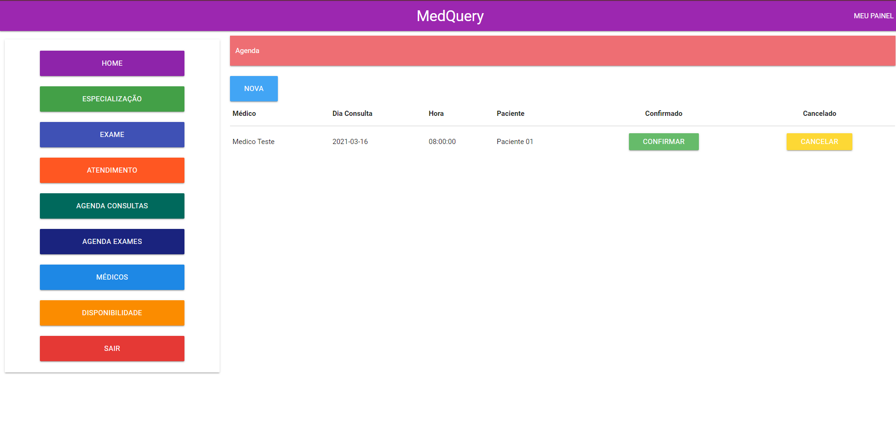
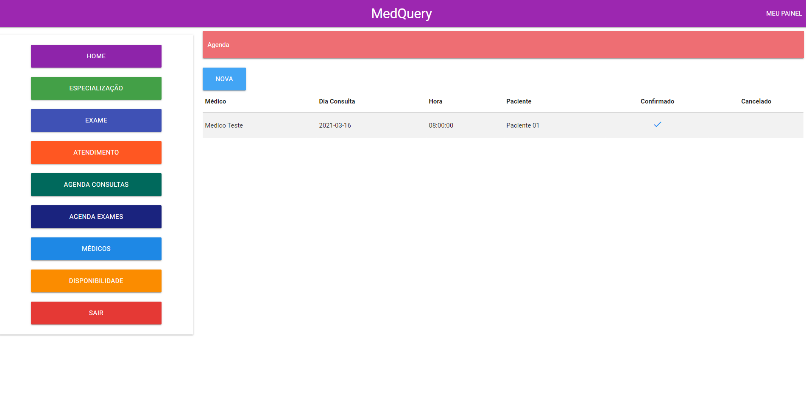
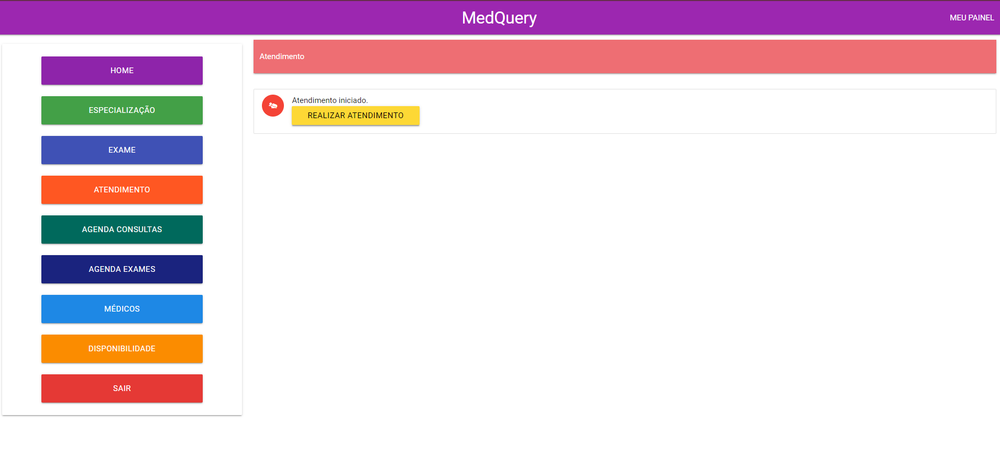
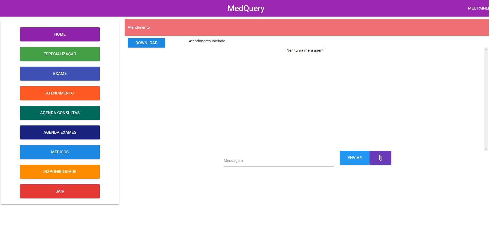
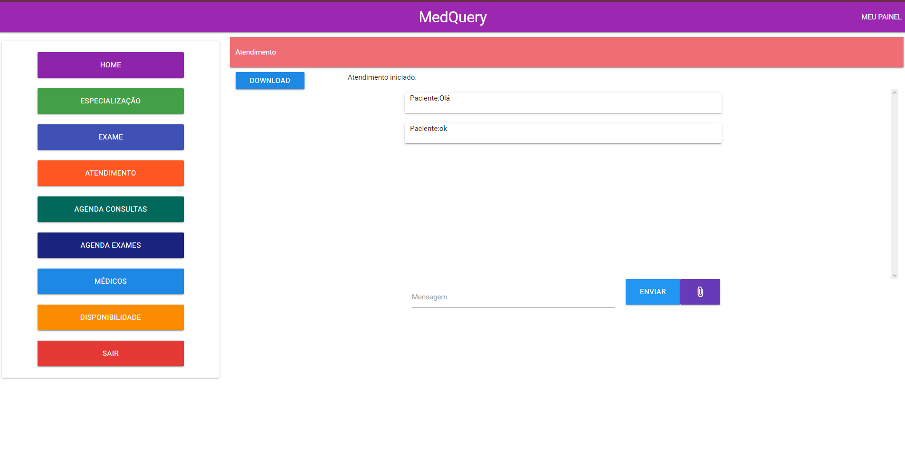
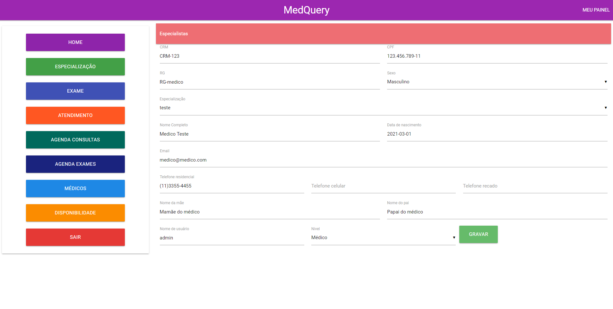
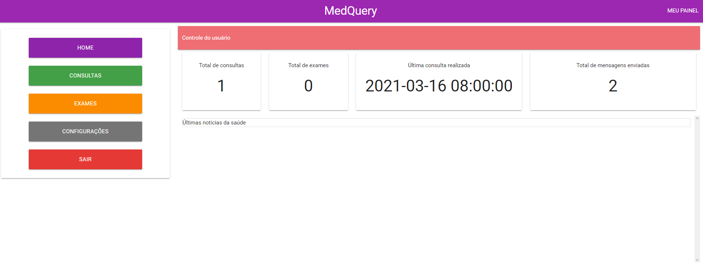
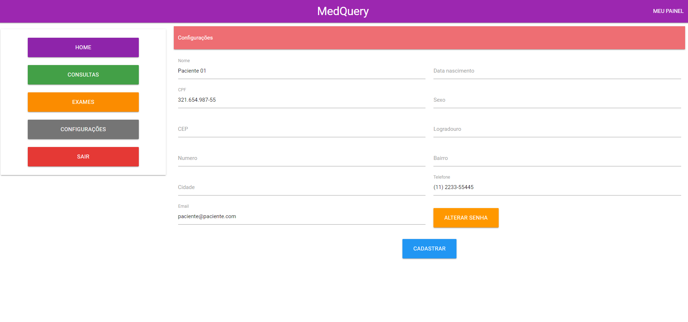
